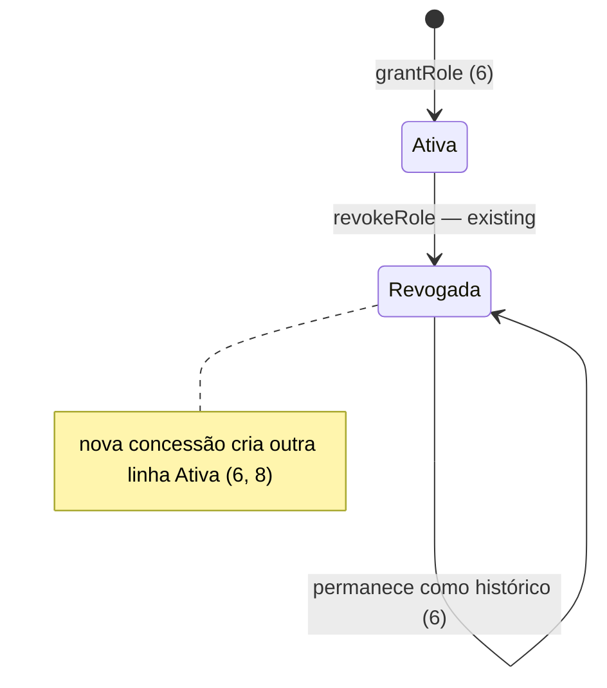

# A — Admin e autenticação: consulta manual, papéis, cadastro sem confirmação e recuperação de senha

> Build this with **tlc-implement**.
> Every criterion below becomes a check with a proof, referenced by its number. Nothing under
> `Unresolved` gets settled while building.

## Intent

O botão "Consulta imediata" do admin falha em produção: `quickCreateConsultation`
(`src/app/admin/actions.ts`) grava `paid_at`/`queued_at` com o relógio do servidor Node **antes** do
INSERT, e o `created_at` (default `now()` do banco) sai depois, violando a CHECK `timestamps_order`
(`paid_at >= created_at`). A única consulta manual existente (2026-05-29) só passou porque o relógio
local estava 1,01 s adiantado. Um admin rebaixado não voltava a ser admin porque `user_roles` tinha
`UNIQUE (user_id, role)` contando linhas revogadas — o Victor ficou sem admin desde 2026-09-12. O
cadastro exigia confirmar o e-mail antes de entrar e pagar. E quem esquece a senha não tem saída:
não existe fluxo de recuperação (só `/trocar-senha`, restrito a `must_change_password`).

Quando isto for entregue: o admin gera consulta manual que cai na fila do cockpit; papéis revogados
podem ser re-concedidos; o paciente cadastra e paga sem confirmar e-mail; quem esqueceu a senha pede
um link por e-mail em `/esqueci-senha` e define outra em `/redefinir-senha`.

**Já aplicado em produção em 2026-09-29 (antes do build, via MCP):** migration
`20260929000000_user_roles_unique_active_parcial` (arquivo em
`doutorfacilita/supabase/migrations/`, precisa entrar neste PR); nova linha `admin` ativa para
`victorhoura@hotmail.com`; `email_confirmed_at` preenchido nas 3 contas pendentes. O Lucca desligou
"Confirm email" no dashboard do Supabase. O build **verifica** esses critérios, não os refaz.

16 critérios em 4 fatias · 2 one-way doors (1 migration, já aplicada) · 5 em aberto, dos quais 3 bloqueiam go-live

## Criteria

### Consulta manual pelo admin

1. Dado um admin em `/admin` ou `/admin/pacientes`, quando escolhe um paciente em "Consulta imediata" e confirma, então o modal mostra "Consulta criada na fila" com o id, e a linha em `consultations` tem `status = in_queue`, `payment_id` iniciando com `ADMIN-MANUAL-`, `amount_cents = 3990`, `paid_at >= created_at` e `queued_at >= paid_at` — independentemente de o relógio do servidor da aplicação estar atrás do relógio do banco.
2. Quando a consulta manual é criada, então ela aparece na fila do `/cockpit` de um médico logado sem recarregar a página (`v_cockpit_fila`: `in_queue` com `doctor_id` nulo).

### Cadastro e pagamento sem confirmação de e-mail

3. Com "Confirm email" desligado, quando um paciente conclui o `/cadastrar`, então `signUp` devolve sessão, a tela "confirme seu email" não aparece e o paciente vai para `/login/redirect` → `/checkout`.
4. Dado um paciente cujo e-mail nunca foi confirmado, quando paga por cartão ou PIX no `/checkout`, então o pagamento é processado e ele segue para a `/fila` — nenhum passo (middleware, páginas, edge functions `mp-process-payment`/`mp-webhook`) lê `email_confirmed_at`.
5. `select count(*) from auth.users where email_confirmed_at is null` retorna 0 e as 3 contas backfilladas entram em `/login` com a própria senha.

### Re-conceder papel de admin

6. Dado um usuário com linha `admin` revogada, quando um admin liga o toggle "Admin" dele em `/admin/medicos`, então o toggle continua ligado após recarregar, existe uma nova linha `role = 'admin'` com `revoked_at IS NULL`, e a linha revogada anterior continua com o `revoked_at` original.
7. Quando o mesmo papel é revogado e concedido de novo 3 vezes seguidas, então cada ciclo termina sem erro e o `audit_log` tem uma entrada `grant_role`/`revoke_role` por ação.
8. Always, existe no máximo uma linha com `revoked_at IS NULL` por (`user_id`, `role`) — índice único parcial `unique_active_role` (Decided 1), inclusive com duas concessões simultâneas.
9. `victorhoura@hotmail.com` tem papel `admin` ativo e `/admin` não o redireciona para `/cockpit`.

### Recuperação de senha

10. Dado um visitante sem sessão, quando abre `/esqueci-senha`, então vê campo "E-mail" e botão "Enviar link"; a página não redireciona para `/login`.
11. Quando envia um e-mail, então `supabase.auth.resetPasswordForEmail` é chamado com redirect para o fluxo que termina em `/redefinir-senha`, e a tela mostra "Se existir uma conta com esse e-mail, enviamos um link para redefinir a senha." — a mesma mensagem para e-mail cadastrado e não cadastrado.
12. Quando o usuário abre o link recebido, então chega em `/redefinir-senha` com sessão de recuperação, vê "Nova senha" e "Confirmar senha" com as mesmas regras de senha do `/cadastrar` (`PasswordChecklist` / `cadastroSchema`), e ao salvar a senha é trocada e ele vai para `/login/redirect`.
13. Depois da troca, a senha antiga é recusada em `/login` ("Email ou senha inválidos") e a nova entra.
14. Se o link está expirado, já usado ou inválido, então `/redefinir-senha` mostra "Link inválido ou expirado" e um botão "Pedir novo link" → `/esqueci-senha`.
15. Se as senhas não coincidem ou não cumprem as regras, então o formulário mostra o erro no campo e não chama `updateUser`.
16. Se o Supabase responde limite de envio (HTTP 429 / `over_email_send_rate_limit`), então `/esqueci-senha` mostra "Muitas tentativas. Aguarde alguns minutos e tente de novo."

## States

## Out of scope

- O link "Esqueci minha senha?" dentro do `/login` — é da task C (redesign do `/login`); aqui só as rotas. Merge A antes de C.
- Visual novo das páginas de senha — usam o card `auth-*` já existente (mesmo do sucesso do `/cadastrar`).
- Impedir que um admin revogue o próprio papel / o último admin — risco de lockout não pedido.
- Papéis `carteira`/`agendamento` — seguem stub.
- Template do e-mail de recuperação no Supabase — ver Unresolved 3.

## Observable

| Surface | Decision | Landing |
| --- | --- | --- |
| screen modal "Consulta imediata" | error state | existing - `result.error` em vermelho |
| screen modal "Consulta imediata" | empty / loading | existing - "Nenhum paciente encontrado." / botão desabilitado em `pending` |
| screen `/admin/medicos` toggle | error state | existing - toggle volta e mostra `res.error` |
| screen `/cadastrar` | pós-cadastro | 3 |
| screen `/esqueci-senha` | estado inicial / enviado | 10, 11 |
| screen `/esqueci-senha` | error / rate limit | 16 |
| screen `/esqueci-senha` | loading | Unresolved 5 |
| screen `/redefinir-senha` | link inválido | 14 |
| screen `/redefinir-senha` | validação | 15 |
| screen `/redefinir-senha` | sucesso | 12 |
| screen `/esqueci-senha`, `/redefinir-senha` | unauthorised | 10 (públicas); `/redefinir-senha` sem sessão de recuperação → 14 |
| e-mail de recuperação | texto / idioma | Unresolved 3 |

## Swept

- validation: 15; e-mail em `/esqueci-senha`: existing - `type="email"` do input
- failure modes: 14, 16; demais: existing - mensagens de erro já presentes
- idempotency and retry: 8; pedir o link duas vezes: n/a - o último link vale, comportamento do Supabase Auth
- authorization: existing - `has_role('admin')` em `admin/layout.tsx` + RLS; 10 (rotas públicas)
- concurrency and ordering: 8
- data lifecycle: 5, 6
- external-dependency failure: 16; entrega do e-mail: Unresolved 2
- state transitions: 1, 6
- observability: existing - `audit_log` (`create` consultation `via: admin_manual`, `grant_role`, `revoke_role`); 7

## Impact

| Front | What changes |
|---|---|
| domain | `unique_active_role` passou de "uma linha por usuário+papel" a "uma linha **ativa**" — `grantRole`, `revokeRole`, `inviteDoctor`, `has_role()` já filtram `revoked_at IS NULL` |
| domain | "cadastro confirmado" deixa de existir — a tela `emailSent` do `CadastroWizard` fica inalcançável (manter como fallback) |
| stored data | migration já aplicada; backfill de 3 linhas já aplicado |
| auth | contas novas sem prova de posse do e-mail; `/redefinir-senha` depende de redirect URLs do Supabase Auth |
| routes | novas rotas públicas `/esqueci-senha`, `/redefinir-senha` (+ callback de troca de código, se o fluxo PKCE do `@supabase/ssr` exigir); conferir `src/middleware.ts` matcher |

## Decided

| Decision | Shape | Alternative rejected |
|---|---|---|
| Unicidade só entre papéis ativos (aplicado) | `DROP CONSTRAINT unique_active_role;` + `CREATE UNIQUE INDEX unique_active_role ON public.user_roles (user_id, role) WHERE revoked_at IS NULL;` | Reativar a linha revogada: sobrescreve `granted_at`/`granted_by` e apaga o histórico que o soft-delete ("NUNCA DELETE") preserva |
| Contas pendentes confirmadas (aplicado) | `UPDATE auth.users SET email_confirmed_at = now() WHERE email_confirmed_at IS NULL` (3 linhas) | Deixar: conta não confirmada pode seguir recusada no `signInWithPassword` |
| Mensagem neutra na recuperação | Mesmo texto para e-mail existente e inexistente (11) | Dizer "e-mail não encontrado": revela quem é paciente de uma plataforma médica |

## Sources

- Mensagem do Lucca (2026-09-29, chat): "no painel admin, nao consigo gerar consultas manualmente." · "confirmacao de email nao deve ser obrigatorio para validacao de cadastros e pagamentos." · "não consegui torná-lo admin novamente de volta. Ajuste o bug e adicione o email do victor com role de admin." · "construir agora o fluxo de Esqueci minha senha." · "desabilitei o confirm email".
- Banco de produção `tylpojscdbkzulykdguv` (lido 2026-09-29): CHECK `timestamps_order`; `v_cockpit_fila`; `unique_active_role`.

This task is the record of decision. If a linked document diverges, ask before building.

## Unresolved

| # | Kind | Question | Until answered |
|---|---|---|---|
| 1 | blocks go-live | Supabase Auth → URL Configuration: Site URL `https://www.meuplantaodigital.com` e redirect allowlist `https://www.meuplantaodigital.com/**` (+ `http://localhost:3000/**` para dev) — ação do Lucca no dashboard | O link do e-mail pode voltar para o domínio errado; 12 não funciona em produção |
| 2 | blocks go-live | O projeto usa SMTP próprio? O SMTP padrão do Supabase só entrega para membros da organização e tem limite baixo. | Recuperação pode não chegar a pacientes reais |
| 3 | blocks go-live | Template "Reset Password" no dashboard do Supabase está em inglês por padrão; traduzir e apontar o link para o fluxo usado pelo código | Paciente recebe e-mail em inglês / com link incompatível |
| 4 | open | Texto neutro de 11 e de 16 | Escrito no meio-tempo: textos dos critérios |
| 5 | open | Estado de carregamento dos botões | Escrito no meio-tempo: botão desabilitado com "Enviando..." / "Salvando..." |
